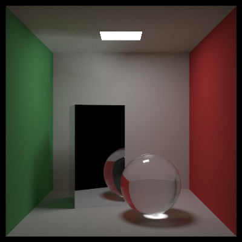
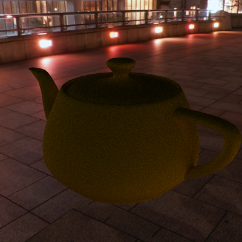
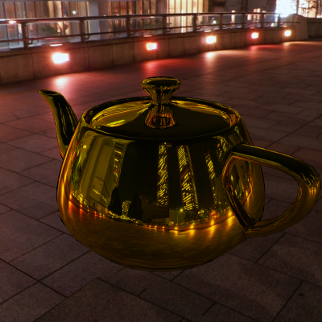
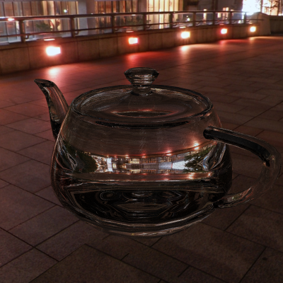
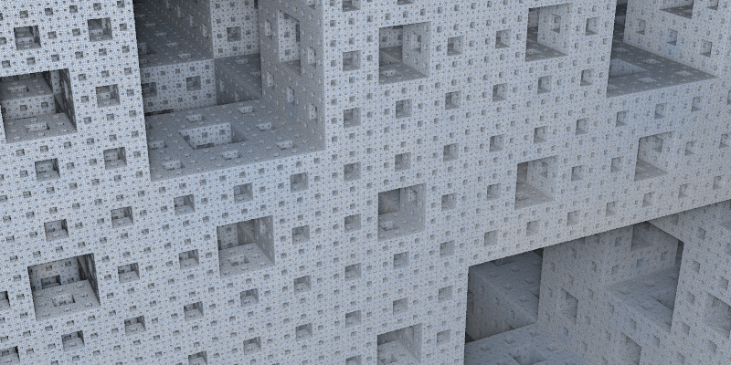
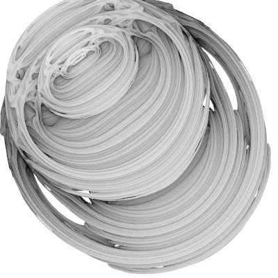
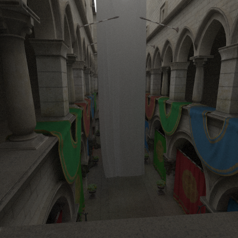
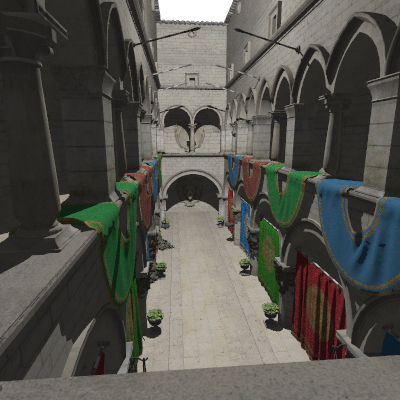
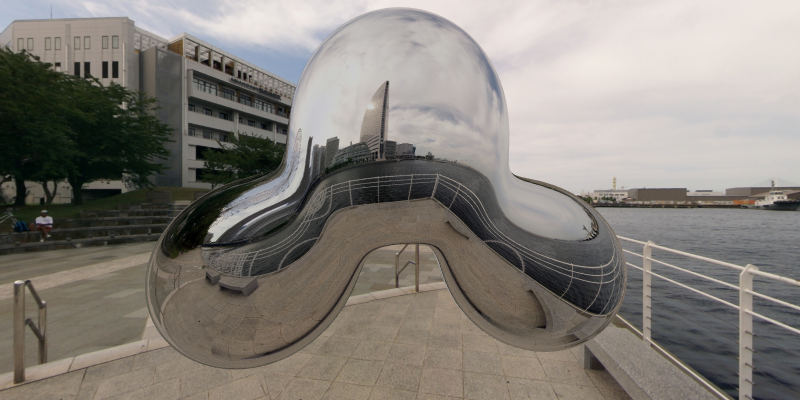

# Raytracer

## Scenes

### `scenes/cornell_box.cr`

_400x400px, 20000 samples / pixel, time: ~4h_

### `scenes/light2.cr`

_800x400px, 10000 samples / pixel, time: 2h15m_

### `scenes/teapot.cr`

_400x400px, 100 samples / pixel, no lights, 2464 triangles with interpolated normals, time: 64s, 60s, 120s_

The cube map in this example is
"[Yokohama 3](http://www.humus.name/Textures/Yokohama3.zip)" by
[Emil "Humus" Persson](http://www.humus.name/index.php?page=Textures),
licensed under [CC BY 3.0](http://creativecommons.org/licenses/by/3.0/)

### `scenes/minecraft.cr`

_800x400px, 100 samples / pixel, no lights, time: 410s_

### `scenes/fractal1.cr`

_400x400px, 5 samples / pixel, no lights, time: 3m10s_

### `scenes/fractal2.cr`

_800x400px, 3 samples / pixel, no lights, time: 18s_

### `scenes/fractal5.cr`

_400x400px, 5 samples / pixel, no lights, time: 30s_

### [WIP] `scenes/sponza.cr`

_400x400px, 5000 samples / pixel, 1 light, time: 13h_

Model: [Crytek Sponza](http://www.crytek.com/cryengine/cryengine3/downloads)

### [WIP] `scenes/sponza_phong.cr`

_400x400px, 5 samples / pixel, 1 light, phong lighting, time: 37s_

Model: [Crytek Sponza without Banner](http://graphics.cs.williams.edu/data/meshes.xml#2)

### `scenes/metaball.cr`

_800x400px, 10 samples / pixel, no lights, time: 5m_

The cube map in this example is
"[Yokohama](http://www.humus.name/Textures/Yokohama.zip)" by
[Emil "Humus" Persson](http://www.humus.name/index.php?page=Textures),
licensed under [CC BY 3.0](http://creativecommons.org/licenses/by/3.0/)

In order to run this example:

1. Download the [set of cubemaps](http://www.humus.name/Textures/Yokohama.zip)
2. Unzip the folder
3. Convert each .jpg to .png
    e.g. using `mogrify -format png *.jpg` etc.
    (`convert` is part of the imagemagick)
4. Copy all six png files (`negx.png`, `negy.png`, `negz.png`, `posx.png`, `posy.png`, `posz.png`) to `cube_maps/Yokohama`
5. Mirror `negx.png`, e.g. using `convert negx.png -flop negx.png` 

## Resources

* [Raytracing in One Weekend](http://in1weekend.blogspot.de/2016/01/ray-tracing-in-one-weekend.html)
* [Raytracing: the Next Week](http://in1weekend.blogspot.de/2016/01/ray-tracing-second-weekend.html)
* [Raytracing: the Rest of your Life](http://in1weekend.blogspot.de/2016/03/ray-tracing-rest-of-your-life.html)
* [Modeling with Distance Functions](http://iquilezles.org/www/articles/distfunctions/distfunctions.htm)
* [Distance Estimated 3D Fractals (I-V)](http://blog.hvidtfeldts.net/index.php/2011/06/distance-estimated-3d-fractals-part-i/)

## Models

* `teapot.obj` (Utah teapot, used by `scenes/teapot1.cr`)

