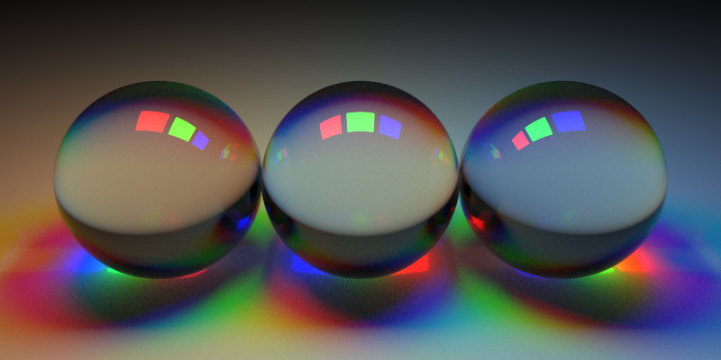
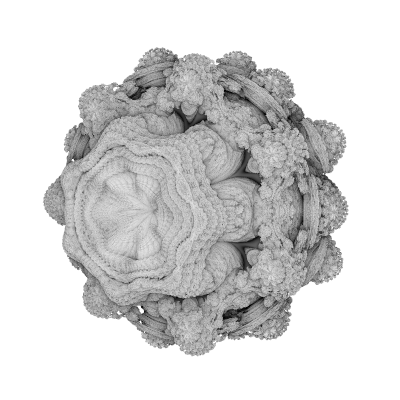

# raytracer-crystal

## Hitables

### Primitives

* `Sphere`
* `Triangle`
* `XYRect`, `XZRect`, `YZRect` (axis aligned rectangles)

### Compound

* `Cuboid` (constructs a `HitableList` with a Rect for each side)

### Collections of other `Hitable`s

* `HitableList` (a simple list, optimal for scenes with few objects)
* `BVHNode` (bounding volume hierarchy -> tree structure, might be faster for scenes with >5k objects)

## Materials

* `Lambertian` (diffuse)
* `Metal` (reflective)
* `Dielectric` (transmissive, e.g. glass or water)
* `DiffuseLight` ([WIP] diffuse emissive)

## Raytracers [WIP]

* `Raytracer` (supports emissive materials -> pretty slow, the background is black)
* `SimpleRaytracer` (ignores emissive materials, the background is "sky" colored)
* `CubeMapRaytracer` (ignores emissive materials, the background color gets calculated by a cube map)

## Textures [WIP]

* `ConstantTexture`
* `CheckerTexture` (creates a checkerboard pattern from two other textures)
* `NoiseTexture` (perlin noise as a texture)

## Misc

* `Vec3` (3D Vector, used for points, vectors and colors)
* `Ray`
* `Camera`
* `CubeMap`
* `Perlin` (used to generate 3d perlin noise)
* `AABB` (axis aligned bounding boxes, used by `BVHNode`s)

## Distance Estimation [WIP]

A way to "trace" objects that have no analytic hit/distance function
(e.g. fractals).

* `DE::DistanceEstimator` (Wrapper to make a `Hitable` from `DE::DistanceEstimatable` using ray marching to find intersections)

### Primitives

* `DE::Sphere(radius)`
* `DE::Box(dimensions : Vec3)`
* `DE::Torus(radius, width)`
* `DE::Prism(height, length)`
* `DE::Cylinder(radius, length)`

### Fractals

* `DE::Mandelbulb(iterations, power)`

### Distance Operations

* `DE::Union(de1, de2)`
* `DE::Intersection(de1, de2)`
* `DE::Difference(de1, de2)`

### Domain Operations

* `DE::Repeat(de, modules : Vec3)` (repeat every `modules.x` "units" on the x-axis, etc.) 

## Scenes / Images

### `scenes/light2.cr`

_800x400px, 2000 samples / pixel, time: 600s_

### `scenes/teapot1.cr`

_800x400px, 50 samples / pixel, no lights, 2464 triangles, time: 62s_

### `scenes/minecraft.cr`

_800x400px, 100 samples / pixel, no lights, time: 410s_

### `scenes/fractal1.cr`

_400x400px, 5 samples / pixel, no lights, debug mode (color = normal), time: 160s_

### `scenes/cube_map1.cr`

[Animation on imgur](http://imgur.com/qMTPt9f)

_360 frames a 400x400px, 20 samples / pixel, no lights, time: 725s_  

The cube map in this example is
"[Yokohama](http://www.humus.name/Textures/Yokohama3.zip)" by
[Emil "Humus" Persson](http://www.humus.name/index.php?page=Textures),
licensed under [CC BY 3.0](http://creativecommons.org/licenses/by/3.0/)

In order to run this example:

1. Download the [set of cubemaps](http://www.humus.name/Textures/Yokohama3.zip)

2. Unzip the folder

3. Convert each .jpg to .png
    e.g. using `convert negx.jpg negx.png` etc.
    (`convert` is part of the imagemagick)

4. Copy all six png files (`negx.png`, `negy.png`, `negz.png`, `posx.png`, `posy.png`, `posz.png`) to `cube_maps/Yokohama`

## Resources

* [Raytracing: the Next Week](http://in1weekend.blogspot.de/2016/01/ray-tracing-second-weekend.html)
* [Raytracing in One Weekend](http://in1weekend.blogspot.de/2016/01/ray-tracing-in-one-weekend.html)
* [Modeling with Distance Functions](http://iquilezles.org/www/articles/distfunctions/distfunctions.htm)
* [Distance Estimated 3D Fractals (I-V)](http://blog.hvidtfeldts.net/index.php/2011/06/distance-estimated-3d-fractals-part-i/)

## Models

* `teapot.obj` (Utah teapot, used by `scenes/teapot1.cr`)

