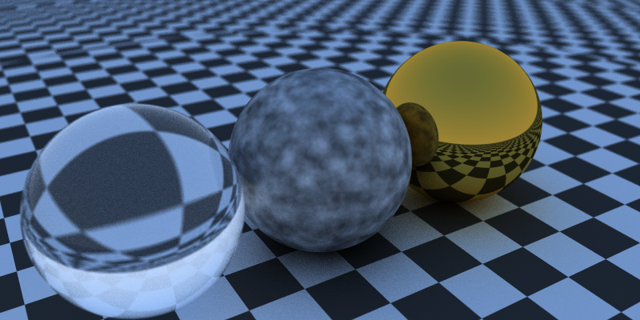

# raytracer-crystal

## Examples

### Old

### `scenes/light1.cr`

_400x200px, 1000 samples / pixel, rendertime: 320s_

### `scenes/light2.cr`

_800x400px, 2000 samples / pixel, rendertime: 600s_

### `scenes/cornell_box.cr`

_400x400px, 4000 samples / pixel, rendertime: 770s_

### `scenes/teapot1.cr`

_800x400px, 50 samples / pixel, no lights, 2464 triangles, rendertime: 41min_

### `scenes/minecraft.cr`

_800x400px, 100 samples / pixel, no lights, rendertime: 410s_
