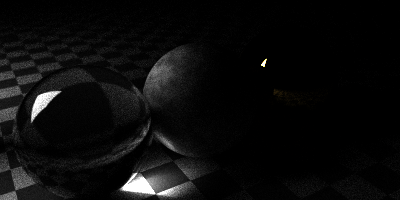

# raytracer-crystal

## Examples

### Old

### `scenes/light1.cr`

_400x200px, 1000 samples / pixel, time: 320s_

### `scenes/light2.cr`

_800x400px, 2000 samples / pixel, time: 600s_

### `scenes/cornell_box.cr`

_400x400px, 4000 samples / pixel, time: 770s_

### `scenes/teapot1.cr`

_800x400px, 50 samples / pixel, no lights, 2464 triangles, time: 41min_

### `scenes/minecraft.cr`

_800x400px, 100 samples / pixel, no lights, time: 410s_

### `scenes/cube_map1.cr`

[Animation on imgur](http://imgur.com/qMTPt9f)

_360 frames a 400x400px, 20 samples / pixel, no lights, time: 725s_  

The cube map in this example is
"[Yokohama](http://www.humus.name/Textures/Yokohama3.zip)" by
[Emil "Humus" Persson](http://www.humus.name/index.php?page=Textures),
licensed under [CC BY 3.0](http://creativecommons.org/licenses/by/3.0/)

